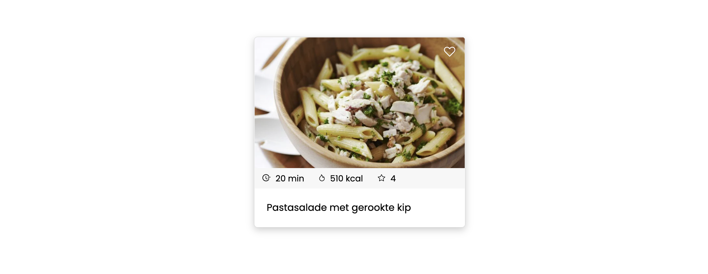
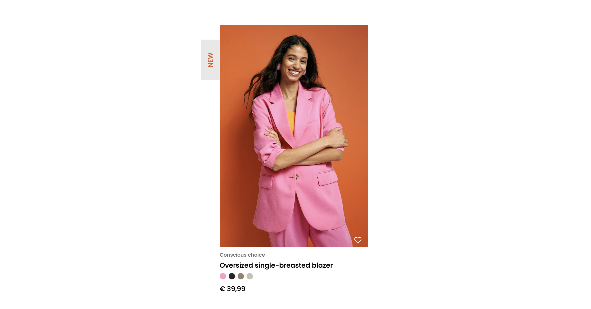

# Opdrachtomschrijving

Je gaat op twee verschillende manieren oefenen met de `position`-property. Eerst met een
receptenkaart [opdracht 1](#opdracht-1) en daarna met een [product uit een webshop](#opdracht-2). Geen zorgen: je staat
er niet alleen voor. Door de bijgevoegde stappenplannen te volgen bereik je het gewenste eindresultaat.

Je kunt deze opdracht maken door het project te clonen of te downloaden naar jouw eigen computer via deze GitHub
repository. De uitwerkingen staan op de branch _uitwerkingen_. Wanneer je liever handmatig een eigen project opzet, mag
dit ook. Zorg dan dat je alle HTML in jouw HTML-bestand plaatst én alle afbeelding handmatig in jouw project opslaat.

## Opdracht 1

### Eindresultaat

Je vindt de opdracht in de map `opdracht-1`. Deze map bevat de volgende bestanden:
* Een `assets`-map met daarin de vier icoontjes die je nodig hebt én de afbeelding van de pastasalade;
* `index.html` met daarin een (bijna) lege body: deze vul jij aan met jouw uitwerkingen;
* `styles.css`: dit bestand is, op één class na, nog leeg.

### Stappenplan

1. Begin met de opzet van het CSS-document:
    * Importeer _Poppins_ als lettertype van Google Fonts en wijs deze toe in de body;
    * Zet de `box-sizing` op `border-box`. Dit noemen we een CSS reset;
    * Zet de kleuren (lichtgrijs `#F7F7F7` en donkergrijs `#d3d3d3`) alvast in commentaar bovenaan het bestand, zodat je
      ze gemakkelijk kunt kopiëren.
2. Geef het article-element in de body afgeronde hoeken, een donkergrijze rand en een zachte schaduw.
3. Plaats de afbeelding en titel (_"Pastasalade met gerookte kip"_) in het article-element. Zorg dat de afbeelding 100%
   van de breedte van zijn parent aanneemt, in plaats van zo buiten beeld te vallen. Zorg ook dat de titel er zo uitziet
   als in het voorbeeld.
4. Wellicht valt het je nu op dat de afbeelding zich niks aantrekt van de ronde hoeken van het article-element... Voeg
   daarom `overflow: hidden;` toe aan de declaraties van het **article**. Als het goed is, blijft de afbeelding nu
   binnenboord.
5. Plaats nu een lichtgrijze balk tussen de titel en de afbeelding. Maak hierin drie groepjes van een icoontje en een
   tekst en zorg dat ze er zo uit zien als het voorbeeld. _Tip:_ je kunt hier het best ``-elementen voor
   gebruiken. Weet jij ook waarom?
6. Helaas geeft de browser automatisch witruimte weer tussen afbeeldingen en opvolgende elementen. Voor deze ene keer
   mag je daarom negatieve `margin` gebruiken, om ze tegen elkaar aan te krijgen.
7. Je bent er bijna! Tijd om de `position`-property te gaan gebruiken om het hartje rechtsbovenaan de afbeelding te
   krijgen:
    * Plaats het hartje als afbeelding in het article-element;
    * Vergeet niet de _parent_ (het article-element dus) eerst een `position: relative;` te geven, anders kunnen we de
      afbeelding niet absoluut positioneren.
    * Positioneer ten slotte het hartje op de juiste plek met `position: absolute` en twee offset properties.

## Opdracht 2

### Eindresultaat

Je vindt de opdracht in de map `opdracht-2`. Deze map bevat de volgende bestanden:
* Een `assets`-map met daarin het hart-icoontje en de afbeelding van het model met de blazer;
* `index.html` met daarin een (bijna) lege body: deze vul jij aan met jouw uitwerkingen;
* `styles.css`: dit bestand is nog leeg.

### Stappenplan
1. Begin met de opzet van het CSS-document:
    * Importeer _Poppins_ als lettertype van Google Fonts en wijs deze toe in de body;
    * Zet de `box-sizing` op `border-box`. Dit noemen we een CSS reset;
    * Zet de kleuren (oranje `#DE6127`, lichtgrijs `#e8e8e8`, donkergrijs `#737373` en de kleuren voor de bolletjs, `#faa0c7`, `#272729`, `#928471` en `#c2c2b4`) alvast in commentaar bovenaan het bestand, zodat je ze gemakkelijk kunt kopiëren.
2. Plaats twee div-elementen in het lege `<article>` en voorzie deze van duidelijke class-namen. We gebruiken de eerste div als groepje voor alle elementen rondom de afbeelding. De tweede div dient als groepje voor de informatie over dit product.
3. Plaats de afbeelding in de eerste `
`. Zorg dat de afbeelding 100% van de breedte van zijn parent aanneemt.
4. Plaats ook het hartje in de eerste `
` en positioneer deze op de juiste plek (rechtsonderaan de afbeelding). _Tip:_ vergeet de `position: relative;` op de `
` (parent) niet, anders ben je straks het hartje kwijt.
5. Plaats ook een ``-element met het woord "New" in de eerste `
`. Wacht nog even met positioneren: zorg er eerst voor dat het element eruitziet zoals het voorbeeld, door gebruik te maken van de juiste lettergrootte, padding en kleuren.
6. Draai het label nu een kwartslag. _Tip:_ kijk eens bij naar de [rotate-functie](https://developer.mozilla.org/en-US/docs/Web/CSS/transform-function/rotate).
7. Positioneer het label nu aan de linkerkant van de afbeelding. _Tip:_ omdat we dit label _buiten_ de parent willen plaatsen, zul je aan de linkerkant gebruik moeten maken van een _negatieve_ offset (minwaarde).
8. Plaats alle titels (_"Conscious choice", "Oversized single-breasted blazer"_ en _"€ 39,99"_) in de tweede `
` en zorg dat dit er zo uit ziet als het voorbeeld.
9. Het enige dat we nu nog nodig hebben, zijn de gekleurde bolletjes. Laten we beginnen met één bolletje: voeg een leeg ``-element toe, geef deze een hoogte, breedte en achtergrondkleur en maak er ten slotte een rondje van door de border-radius te verhogen.
10. Herhaal dit nog drie keer, telkens met een andere kleur, en zorg ervoor dat er wat ruimte tussen de bolletjes ontstaat. Probeer hierin zo min mogelijk dubbele CSS te schrijven.